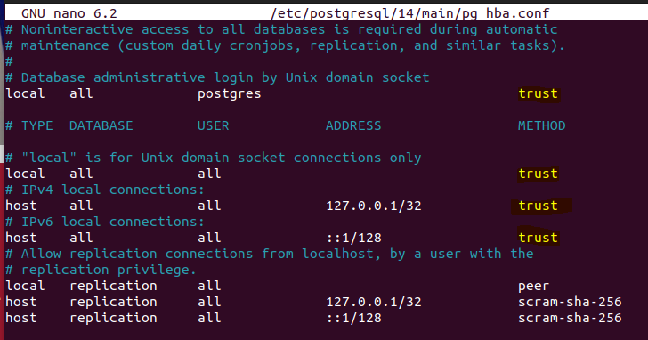

# Docs
https://documentation.opencms.org/opencms-documentation/introduction/get-started/
https://tomcat.apache.org
https://ubuntu.com/download

https://medium.com/@jasonrbodie/learn-linux-install-apache-tomcat-10-and-nginx-on-ubuntu-24-04-5bcdd9fad1c9#b345

# Docker img (mariaDB!)
https://hub.docker.com/r/alkacon/opencms-docker/

# Notas
- Baixar JDK 11 ⚠️
- Atenção ao [OpenCms](#requisitos) que vai ser instalado, a versão do JDK e tomcat vão mudar se for outra versão de OpenCms
- ⚠️ Tomcat 9 = JDK 11 - Pacotes Java EE
- ⚠️ Tomcat 10 = JDK 17 - Pacotes Jakarta

# Requisitos
Pode ser baixado clicando diretamente aqui ou usando **wget**.
- [Ubuntu](https://releases.ubuntu.com/jammy/ubuntu-22.04.5-desktop-amd64.iso) - 22.04
- Java 11 JDK
  - sudo apt install openjdk-11-jdk
- PostgreSQL 14
  - sudo apt install postgresql-14
- [Tomcat 9.0.95](https://downloads.apache.org/tomcat/tomcat-9/v9.0.95/bin/apache-tomcat-9.0.95.tar.gz)
- [OpenCms 13](http://www.opencms.org/downloads/opencms/opencms-13.0.zip)
- Nginx

# Instalando JDK 11
  - sudo apt install openjdk-11-jdk
  - java -version
  - javac -version

# Instalando Tomcat 9.0.35
wget https://downloads.apache.org/tomcat/tomcat-9/v9.0.95/bin/apache-tomcat-9.0.95.tar.gz

tar -zxvf apache-tomcat-9.0.95.tar.gz
sudo mv apache-tomcat-9.0.95 /opt/tomcat

> Testando tomcat
/opt/tomcat/bin/./startup.sh

wget https://localhost:8080

*cat* no index.html que foi baixado pra confirmar caso não seja feito na OS com GUI
cat index.html | grep successfully

# Configurando o PostgreSQL
Alterar o **pg_hba.conf** para **trust** para acessar o postgres sem senha
- [x] Alterar a senha do **postgres** para **postgres**

- **Diretório**:
sudo nano /etc/postgresql/14/main/pg_hba.conf

- Alterar as permissões para trust do ipv4, ipv6, unix, tudo...

CTRL + O = Salvar
CTRL + X = Sair

- Novamente no terminal, execute os comandos na seguinte ordem:

su -
admin
su - postgres
psql
\password
nova senha = postgres
\q
exit
systemctl restart postgresql

# Rodando OpenCms13
Finalmente com tudo configurado, vamos bater na URL do setup do OpenCms
https://localhost:8080/opencms/setup

O setup é simples, as configurações são essas:
No OpenCms
- Setup Connection:
postgres
postgres
template1

- OpenCms Connection:
opencms
opencms

- DB Name: **opencms**
**Create db and user** [x] Check
**Create Tables** [x] Check

NEXT!

Aguardar até o fim da instalação, o site vai abrir automaticamente 🚀🚀 

# Aplicando NGINX ao projeto
sudo apt install nginx

sudo nano /etc/nginx/sites-available/default
ou
sudo nano /etc/nginx/conf.d/

server {
    listen 80;
    server_name localhost;

    location / {
        proxy_pass http://127.0.0.1:8080/opencms/;
        proxy_set_header Host $host;
        proxy_set_header X-Real-IP $remote_addr;
        proxy_set_header X-Forwarded-For $proxy_add_x_forwarded_for;
    }
}

/etc/hosts 
